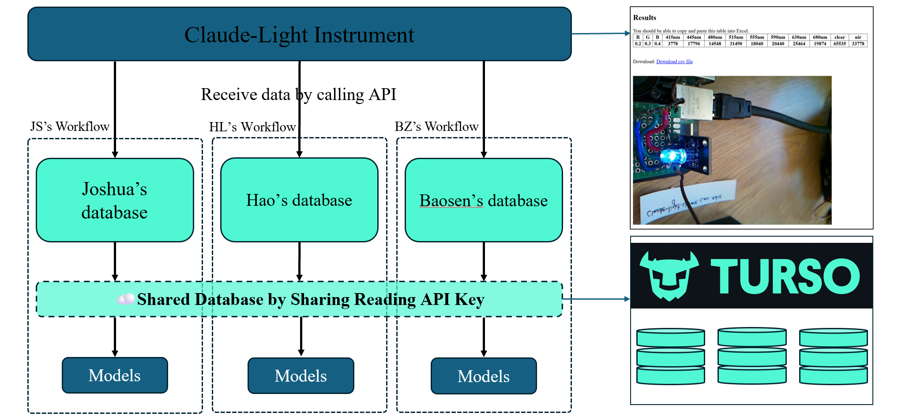
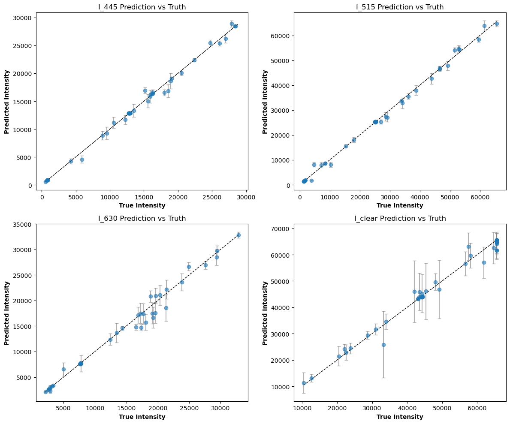
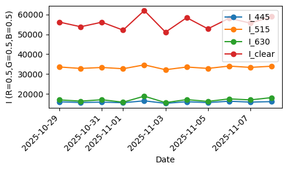

# A distributed data sharing collaboration to build a digital twin of Claude-Light

Dr. John Kitchin from Carnegie Mellon University recently described [Claude-Light](https://doi.org/10.1063/5.0266757) (a REST API accessible Raspberry Pi that controls an RGB LED with a photometer that measures ten spectral outputs) as a lightweight, remotely accessible instrument for exploring the idea of self-driving laboratories. 

We participate in a distributed collaboration to build a digital twin of Claude-Light. The goals are:
1. Demonstrate a distributed collaboration on a remotely automated instrument
2. Demonstrate a data-sharing mechanism through a set of cloud databases
3. Develop a digital twin of Claude-Light

This repository demonstrates how I collaborate within our team to share the databases and build the final models of digital twin of Claude-Light. 

The results are summarized below, which are modeling efforts using both Random Forest (RF) models and a linear meta-learning approach to predict multichannel light intensity data collected from the Claude-light instrument.  

## Random Forest (RF) Models

The workflow for data acquisition and sharing from the Claude-light instrument is shown below. After integrating all collected data, we obtained 218 total entries, with 174 used for training and 44 held out as a test set.  


I trained four separate RF models, one per channel: I-445, I-515, I-630, and I-Clear. The input features (7) included:
- R, G, B values
- Day of year (cyclic)
- Time of day (cyclic)
- Weather conditions (OpenWeather API)
- Cloud cover (OpenWeather API)

The additional environmental features (weather, cloud cover) help account for variations in ambient illumination that affect sensor readings.

The resulting model performance for each channel achieved R2 of 0.995, 0.996, 0.984, 0.983. These are strong results and demonstrate that the RF models fit the collected dataset very well (see figure below). The detailed procedure is in folder `version_250909_RF`.  


During discussions with John after the presentation in 25/09/15, we identified a key limitation: light intensity appears to vary across days (potential degradation or drift). Because RF models primarily interpolate within the observed space, they do not extrapolate well across temporal drift. A better approach would incorporate temporal adaptation, e.g., by explicitly modeling time, or by applying a meta-learning-based framework. Motivated by my curiosity to meta-learning, I explored a linear meta-learning approach.

## Linear Model Meta-learning

Meta-learning is a machine learning paradigm where a model learns how to learn, using experience from previous tasks to improve its ability to learn new tasks more quickly and with less data. Here, I treat each day as a separate task. Data were collected daily from 2025-10-28 to 2025-11-08, and trends were examined by tracking the intensity at fixed values (R=0.5, G=0.5, B=0.5) across days (Fegure below).  


Unlike the RF models, the meta-learning model uses inputs only from R, G, B, without weather-related features, since those environmental effects are assumed to be handled through rapid task-specific adaptation rather than fixed parameters. For evaluation, I selected 11/05, 11/06, 11/07, 11/08 as test period. The major results are shown below.  
```text
Day 20251105 | samples=50 | few-shot=10
R2 before: {'I_445': 0.98, 'I_515': 0.979, 'I_630': 0.96, 'I_clear': 0.852}
R2 after : {'I_445': 0.982, 'I_515': 0.982, 'I_630': 0.966, 'I_clear': 0.876}

Day 20251106 | samples=75 | few-shot=10
R2 before: {'I_445': 0.979, 'I_515': 0.976, 'I_630': 0.959, 'I_clear': 0.802}
R2 after : {'I_445': 0.982, 'I_515': 0.981, 'I_630': 0.965, 'I_clear': 0.804}

Day 20251107 | samples=50 | few-shot=10
R2 before: {'I_445': 0.979, 'I_515': 0.98, 'I_630': 0.977, 'I_clear': 0.893}
R2 after : {'I_445': 0.985, 'I_515': 0.984, 'I_630': 0.979, 'I_clear': 0.901}

Day 20251108 | samples=66 | few-shot=10
R2 before: {'I_445': 0.978, 'I_515': 0.981, 'I_630': 0.976, 'I_clear': 0.83}
R2 after : {'I_445': 0.982, 'I_515': 0.984, 'I_630': 0.978, 'I_clear': 0.83}
```

We can see clearly that for each day, model performance (R2) enhanced after adaptation with 10 examples per day(`few-shot=10`). This confirms that meta-learning can adjust to daily drift better than static RF, though the performance especially I_clear is not comparable to the RF. The detailed procedure is in folder `version_251123_meta-learning`.  
